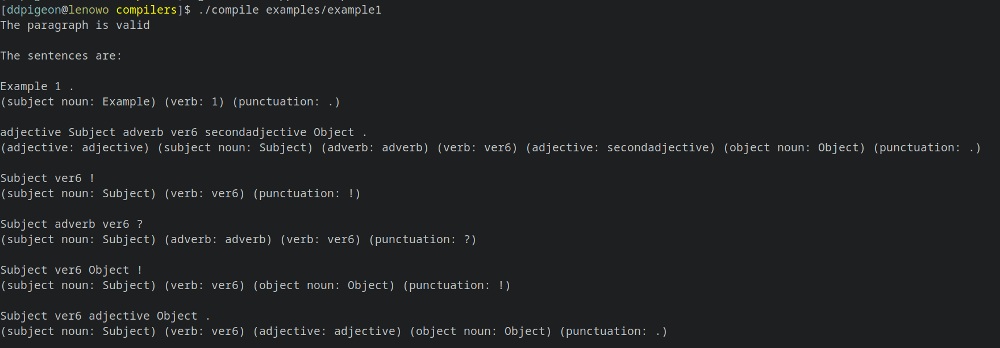

# Compilers task submission
My (Prabhanjan Prabhu, 221CS234) submission for the compilers task for WEC systems/security recruitment.  
<br>

### Dependencies
- [flex](https://github.com/westes/flex)
- [GCC/G++](https://gcc.gnu.org/)  
  <br>

### Usage
_Note:_ I have only tested this on linux, not sure about other operating systems.
Run the following commands to build the binary:

```
flex lexer.lex
g++ parser.cpp -o compile
```

  <br>
Then to run the binary, do:

```
./compile <file>
```

Some example files have been provided in the examples folder. Example 1 showcases many different valid strings, and example 2 showcases the performance of the code on larger paragraphs.
The binary parses the contents of the file into sentences separated by punctuation and then semantically analyzes the sentences to check for validity. If a sentence is valid, then the semantic breakdown of each token is provided.  
<br>

<p align="center"> <em> Screenshot of binary being run on provided example 1.</em> </p>

  <br>

## Implementation and challenges faced
The first step was the lexing, which was implemented using flex/lex fairly easily using pattern matching with regular expressions for the 4 types of tokens.  
<br>
After this, the second part, the parsing was significantly more difficult. I initially wanted to use bison for parsing, and attempted to learn it. However that seemed quite futile as I had spent a couple hours with no progress. Therefore I made the radical decision to implement a specific parser directly using C++ as I didn't have too much time left till the deadline to dedicate a lot of time to learning bison. I implemented sentences as essentially arrays of tokens, and defined a paragraph to be essentially an array of sentences.

The first challenge I faced was parsing the string into tokens to be sent to the lexer, and trying to get the lexer to work with strings (since lex does not accept string inputs by default). I eventually settled on using the boost library for tokenizing, and hardcoded in some spaces between punctuation to make the string uniform. After running these tokens through the lexer, we are left with a large array of tokens. I then split this array into subarrays for sentences, and combined the sentences to form the paragraph.

The next challenge was implementing semantic checking, which I implemented by checking conditions on each word in reverse order using a stack. In this step I was also able to separate adverbs from adjectives.

After this, I implemented differentiation of subject and object nouns by iterating down the sentence, and then could output the semantic analysis of the sentence.  
  <br><br>
All in all, I enjoyed the task and learnt a lot while doing it. I feel I could have implemented more optional tasks if I had checked them out earlier, and not doing so was a bit of a blunder on my part.
